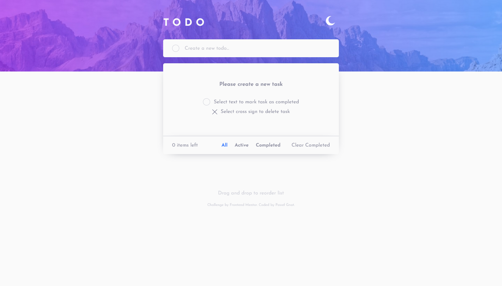

# Frontend Mentor - Todo app solution

This is a solution to the [Todo app challenge on Frontend Mentor](https://www.frontendmentor.io/challenges/todo-app-Su1_KokOW). Frontend Mentor challenges help you improve your coding skills by building realistic projects.

## Table of contents

- [Overview](#overview)
  - [Screenshot](#screenshot)
  - [Links](#links)
- [My process](#my-process)
  - [Built with](#built-with)
  - [What I learned](#what-i-learned)
- [Author](#author)

## Overview

### Screenshot

### Links

- Live Site URL: [Frontend Mentor Todo app](https://pawel-gnat.github.io/Frontend-Mentor-Todo-app/)

## My process

Firstly I created an a initial html structure with empty state information and styled it. Then I implemented my JS functions that allowed me to manipulate with my html elements. At the end I created a local storage and drag and drop functionallity. I also tried to refactore my code a little and make it easier to read and understand.

### Built with

- Semantic HTML5 markup
- CSS custom properties
- Flexbox
- Mobile-first workflow
- JavaScript

### What I learned

I needed 41 hours to complete this app. I learned how to create drag and drop function, keep tasks in a local storage, create, read and delete new elements.

## Author

- Frontend Mentor - [@Pawel-Gnat](https://www.frontendmentor.io/profile/Pawel-Gnat)
